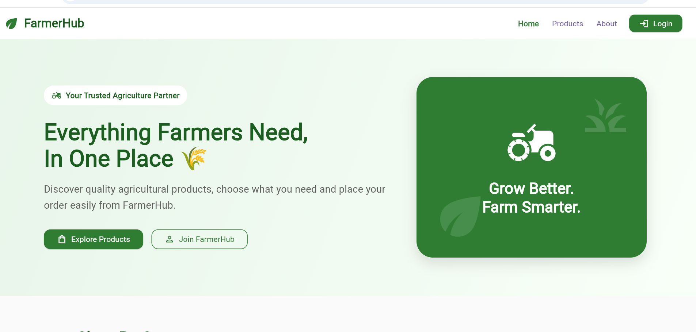
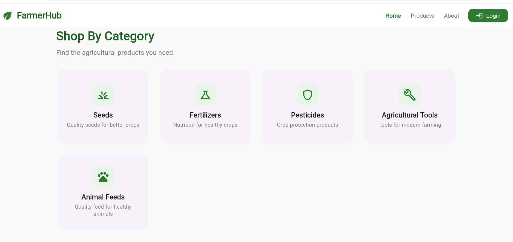
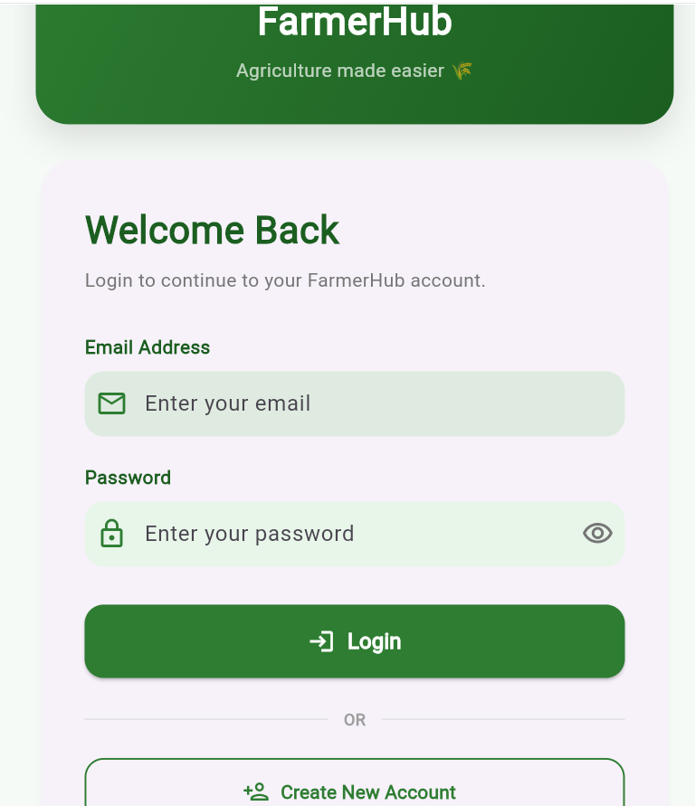
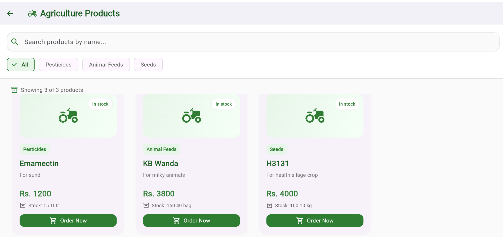
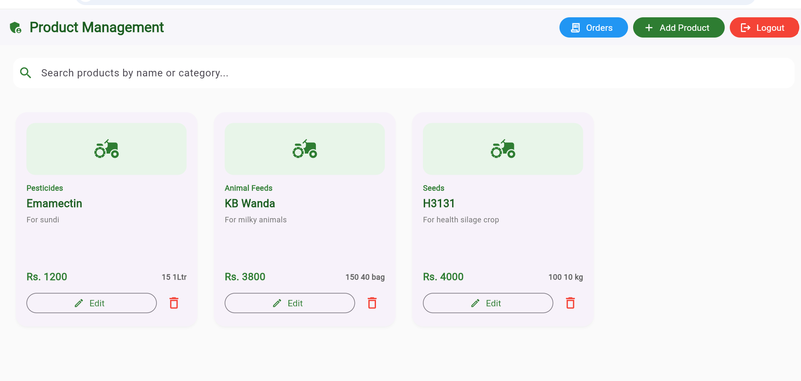
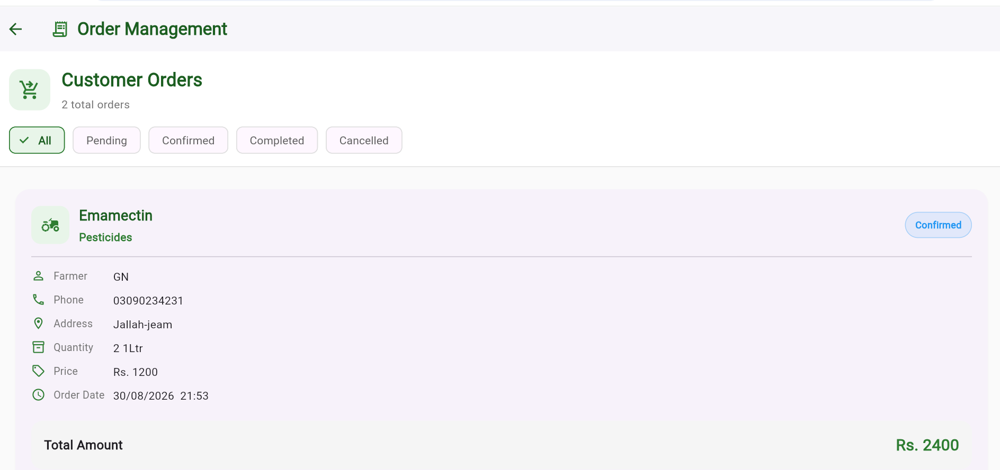
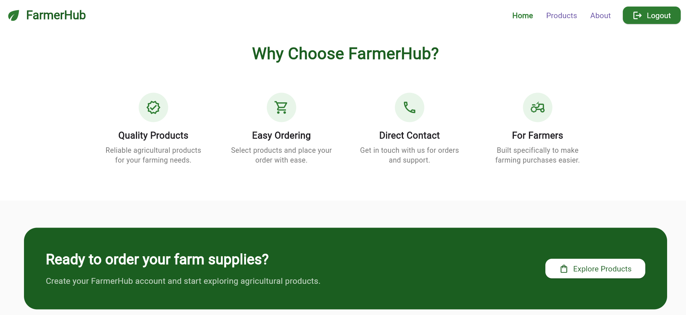

# 🌾 FarmerHub

### Agricultural Products Marketplace built with Flutter & Firebase

FarmerHub is a Flutter-based agricultural marketplace designed to help
farmers explore agricultural products and place orders through a simple,
modern interface.

The project also includes an admin management system for managing products
and monitoring customer orders.

---

## ✨ Features

### 👨‍🌾 Customer

- User registration and login
- Firebase Authentication
- Browse agricultural products
- Explore products by category
- View product details
- Place product orders
- View order information
- Clean and responsive UI

### 👨‍💼 Admin

- Secure admin access
- Add new products
- Edit existing products
- Delete products
- Manage product prices and stock
- View customer orders
- Filter orders by status
- Confirm orders
- Cancel orders
- Complete orders

---

## 🔥 Firebase Integration

FarmerHub uses Firebase for backend functionality.

- Firebase Authentication
- Cloud Firestore
- Real-time product data
- Real-time order management
- Firestore security rules

---

## 🛠️ Technologies Used

- Flutter
- Dart
- Firebase Authentication
- Cloud Firestore
- Git
- GitHub

---

## 🏗️ Project Structure

```text
lib/
├── core/
│   └── responsive.dart
│
├── models/
│   └── product_model.dart
│
├── screens/
│   ├── about_screen.dart
│   ├── admin_order_screen.dart
│   ├── admin_products_screen.dart
│   ├── agriculture_tools_screen.dart
│   ├── category_products.dart
│   ├── home_screen.dart
│   ├── login_screen.dart
│   ├── order_screen.dart
│   ├── products_screen.dart
│   └── register_screen.dart
│
├── services/
│   └── product_service.dart
│
└── main.dart
```

---

## 📸 Screenshots

### 🏠 Home



### 🌾 Categories



### 🔐 Login & Registration



### 🛍️ Products



### 👨‍💼 Admin Product Management



### 📦 Order Management



### 🌱 Why Choose FarmerHub



---

## 📌 Project Status

FarmerHub v1.0.0

The project is developed as a Flutter and Firebase agricultural marketplace
with customer and admin functionality.